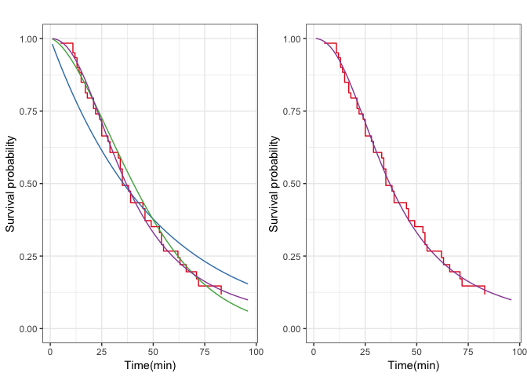

생존분석을 이용한 카페 손님의 이용시간 추정 및 최적 테이블 수 제안
================

-   [Introduction](#introduction)
-   [Data preprocessing](#data-preprocessing)
-   [Non-parametric estimation](#non-parametric-estimation)
-   [Log-rank test](#log-rank-test)
-   [Cox proportional hazard model (in progress)](#cox-proportional-hazard-model-in-progress)
-   [Parametric estimation](#parametric-estimation)
    -   [교내 카페](#교내-카페)
    -   [선릉역 카페](#선릉역-카페)

<!-- README.md is generated from README.Rmd. Please edit that file -->
Introduction
------------

Data preprocessing
------------------

``` r
library(tidyverse)
library(survival)
library(RColorBrewer)
source("src/multiplot.R")
source("src/survival-models.R")
source("src/survival-utils.R")
```

``` r
(cafe_raw <- read_csv("data/cafe.csv"))
```

    ## # A tibble: 155 x 7
    ##    date       cafe_type party_size gender in_time out_time end_of_study
    ##    <date>     <chr>          <dbl> <chr>  <time>  <time>   <time>      
    ##  1 2017-11-17 in_univ            4 male   13:55   14:21    17:35       
    ##  2 2017-11-17 in_univ            2 male   14:21   15:08    17:35       
    ##  3 2017-11-17 in_univ            1 female 14:26   15:00    17:35       
    ##  4 2017-11-17 in_univ            2 mixed  14:27   14:49    17:35       
    ##  5 2017-11-17 in_univ            2 mixed  14:29   16:49    17:35       
    ##  6 2017-11-17 in_univ            3 female 14:33   15:22    17:35       
    ##  7 2017-11-17 in_univ            2 female 14:35   15:32    17:35       
    ##  8 2017-11-17 in_univ            6 mixed  14:37   14:59    17:35       
    ##  9 2017-11-17 in_univ            2 female 14:38   17:31    17:35       
    ## 10 2017-11-17 in_univ            1 female 14:40   15:44    17:35       
    ## # ... with 145 more rows

raw data의 모습입니다. 여기에서 `in_time`은 손님이 입장한 시간, `out_time`은 손님이 퇴장한 시간, `end_of_study`는 관찰을 종료한 시간입니다. 관찰을 종료할 때까지 퇴장하지 않은 손님은 `out_time`을 결측값으로 처리했습니다.

만약 손님이 입장한 지 30분이 지나고 관찰을 종료하였는데 손님이 그때까지 남아있었다면, 그 손님의 이용시간은 30분보다 크다는 것만 알고 정확한 값은 알지 못합니다. 즉, 이용시간을 X라고 하면 (X &gt; 30)이라는 정보만 가지고 있는 셈입니다. 이러한 데이터를 [right censored data](https://en.wikipedia.org/wiki/Censoring_(statistics))라고 합니다. 본 연구에서는 censored data를 주로 다루는 생존분석 기법을 사용하였습니다.

데이터를 생존분석에 맞는 형태로 만들기 위해 아래와 같이 전처리합니다. 최종적으로 `event_time`(*T*), `delta`(*δ*), `cafe_type` 변수를 사용했습니다.

<p align="center">
<i> X = (퇴장시간) - (입장시간)<br> C = (관찰종료시간) - (입장시간)<br> T = min(X, C)<br> δ = (uncensoring indicator) </i>
</p>

``` r
(cafe <- 
  cafe_raw %>% 
  mutate(x = (out_time - in_time) %>% as.numeric(units = "mins"),
         c = (end_of_study - in_time) %>% as.numeric(units = "mins"),
         event_time = minimum(x, c, na.rm = TRUE),
         delta = 1 - is.na(x)) %>% 
  select(event_time, delta, cafe_type))
```

    ## # A tibble: 155 x 3
    ##    event_time delta cafe_type
    ##         <dbl> <dbl> <chr>    
    ##  1         26     1 in_univ  
    ##  2         47     1 in_univ  
    ##  3         34     1 in_univ  
    ##  4         22     1 in_univ  
    ##  5        140     1 in_univ  
    ##  6         49     1 in_univ  
    ##  7         57     1 in_univ  
    ##  8         22     1 in_univ  
    ##  9        173     1 in_univ  
    ## 10         64     1 in_univ  
    ## # ... with 145 more rows

Non-parametric estimation
-------------------------

``` r
survobj <- with(cafe, Surv(event_time, event = delta))
km_survfit <- kaplan_meier(survobj ~ 1)
na_survfit <- nelson_aalen(survobj ~ 1)

config <- list("confidence" = TRUE, 
               "method" = c("geom_step", "geom_step"))

survplot(km_survfit, na_survfit, config = config)
```


먼저 비모수모형인 [Kaplan-Meier](https://en.wikipedia.org/wiki/Kaplan%E2%80%93Meier_estimator)와 [Nelson-Aalen](https://en.wikipedia.org/wiki/Nelson%E2%80%93Aalen_estimator) 방법으로 추정한 생존함수입니다. 매우 일반적인 생존함수 형태를 보이고 있습니다. Kaplan-Meier와 Nelson-Aalen은 이론적으로도 거의 차이가 없는 방법이기 때문에 결과도 유사하게 나타났습니다. Kaplan-Meier는 이후에 여러 모수모형의 적합성을 비교하기 위한 기준으로 사용했습니다.

Log-rank test
-------------

``` r
(logrank <- survdiff(survobj ~ cafe_type, data = cafe))
```

    ## Call:
    ## survdiff(formula = survobj ~ cafe_type, data = cafe)
    ## 
    ##                         N Observed Expected (O-E)^2/E (O-E)^2/V
    ## cafe_type=in_univ      92       67     77.5      1.41      4.84
    ## cafe_type=near_offices 63       45     34.5      3.16      4.84
    ## 
    ##  Chisq= 4.8  on 1 degrees of freedom, p= 0.03

[Log-rank test](https://en.wikipedia.org/wiki/Logrank_test)를 이용해 교내와 선릉 카페의 생존함수에서 유의한 차이가 있는지를 검정했습니다. 귀무가설은 *H<sub>0</sub>: S<sub>교내</sub>(t) = S<sub>선릉</sub>(t)* 으로 나타낼 수 있습니다. 검정 결과 P-value가 0.0277으로 충분히 작으므로 유의한 차이가 있는 것으로 판단했습니다.

Cox proportional hazard model (in progress)
-------------------------------------------

Parametric estimation
---------------------

모수모형을 이용해 교내와 선릉 카페 각각에서의 생존함수를 추정했습니다. 모형은 Exponential, Weibull, Log-logistic 모형을 적용해본 뒤 Kaplan-Meier와 가장 유사한 모형을 선택했습니다. 추가적인 고려사항으로, 카페에서 주문한 음료가 나오기 전에 손님이 먼저 퇴장하는 경우는 없기 때문에, 초기 몇 분 동안은 *S*(*t*)≡1 으로 추정하는 것이 더 정확할 수 있습니다.

추정 결과 교내와 선릉 카페 모두 Log-logistic 모형이 상당히 적합하게 나타났습니다. 또한 교내 카페에서는 초기 5분 동안 *S*(*t*)≡1 으로 추정할 때 결과가 가장 좋았습니다.

### 교내 카페

``` r
univ_mask <- cafe$cafe_type == "in_univ"
univ_regmod <- fit_regression_models(cafe, subset = univ_mask, shift = 5)
# 그래프가 직선에 가까울수록 모형이 데이터를 잘 설명합니다.
multiplot(plotlist = univ_regmod$diagnosis, cols = 3)
```


``` r
allmod_plot <- survplot(survfit_list = univ_regmod$survfits, 
                        config = config)
loglog_plot <- survplot(survfit_list = univ_regmod$survfits[c(1, 4)], 
                        config = loglog_config)
multiplot(allmod_plot, loglog_plot, cols = 2)
```


### 선릉역 카페

``` r
office_mask <- cafe$cafe_type == "near_offices"
office_regmod <- fit_regression_models(cafe, subset = office_mask, shift = 0)
# 그래프가 직선에 가까울수록 모형이 데이터를 잘 설명합니다.
multiplot(plotlist = office_regmod$diagnosis, cols = 3)
```


``` r
allmod_plot <- survplot(survfit_list = office_regmod$survfits, 
                        config = config)
loglog_plot <- survplot(survfit_list = office_regmod$survfits[c(1, 4)], 
                        config = loglog_config)
multiplot(allmod_plot, loglog_plot, cols = 2)
```


