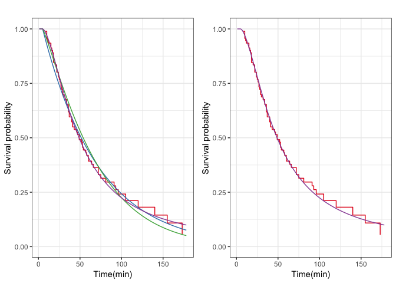

생존분석을 이용한 카페 손님의 이용시간 추정 및 최적 테이블 수 제안
================

-   [Data preprocessing](#data-preprocessing)
-   [Non-parametric estimation](#non-parametric-estimation)
-   [Log-rank test](#log-rank-test)
-   [Cox proportional hazard model (in progress)](#cox-proportional-hazard-model-in-progress)
-   [Regressiong models](#regressiong-models)
    -   [교내 카페](#교내-카페)
    -   [선릉역 카페](#선릉역-카페)

<!-- README.md is generated from README.Rmd. Please edit that file -->
``` r
library(tidyverse)
library(survival)
library(RColorBrewer)
source("src/multiplot.R")
source("src/survival-models.R")
source("src/survival-utils.R")
```

Data preprocessing
------------------

``` r
(cafe_raw <- read_csv("data/cafe.csv"))
```

    ## # A tibble: 155 x 7
    ##    date       cafe_type party_size gender in_time out_time end_of_study
    ##    <date>     <chr>          <dbl> <chr>  <time>  <time>   <time>      
    ##  1 2017-11-17 in_univ            4 male   13:55   14:21    17:35       
    ##  2 2017-11-17 in_univ            2 male   14:21   15:08    17:35       
    ##  3 2017-11-17 in_univ            1 female 14:26   15:00    17:35       
    ##  4 2017-11-17 in_univ            2 mixed  14:27   14:49    17:35       
    ##  5 2017-11-17 in_univ            2 mixed  14:29   16:49    17:35       
    ##  6 2017-11-17 in_univ            3 female 14:33   15:22    17:35       
    ##  7 2017-11-17 in_univ            2 female 14:35   15:32    17:35       
    ##  8 2017-11-17 in_univ            6 mixed  14:37   14:59    17:35       
    ##  9 2017-11-17 in_univ            2 female 14:38   17:31    17:35       
    ## 10 2017-11-17 in_univ            1 female 14:40   15:44    17:35       
    ## # ... with 145 more rows

``` r
(cafe <- 
  cafe_raw %>% 
  mutate(x = (out_time - in_time) %>% as.numeric(units = "mins"),
         c = (end_of_study - in_time) %>% as.numeric(units = "mins"),
         event_time = minimum(x, c, na.rm = TRUE),
         delta = 1 - is.na(x)) %>% 
  select(event_time, delta, cafe_type))
```

    ## # A tibble: 155 x 3
    ##    event_time delta cafe_type
    ##         <dbl> <dbl> <chr>    
    ##  1         26     1 in_univ  
    ##  2         47     1 in_univ  
    ##  3         34     1 in_univ  
    ##  4         22     1 in_univ  
    ##  5        140     1 in_univ  
    ##  6         49     1 in_univ  
    ##  7         57     1 in_univ  
    ##  8         22     1 in_univ  
    ##  9        173     1 in_univ  
    ## 10         64     1 in_univ  
    ## # ... with 145 more rows

Non-parametric estimation
-------------------------

``` r
survobj <- with(cafe, Surv(event_time, event = delta))
km_survfit <- kaplan_meier(survobj ~ 1)
na_survfit <- nelson_aalen(survobj ~ 1)

config <- list("confidence" = TRUE, 
               "method" = c("geom_step", "geom_step"))

survplot(km_survfit, na_survfit, config = config)
```


Log-rank test
-------------

``` r
(logrank <- survdiff(survobj ~ cafe_type, data = cafe))
```

    ## Call:
    ## survdiff(formula = survobj ~ cafe_type, data = cafe)
    ## 
    ##                         N Observed Expected (O-E)^2/E (O-E)^2/V
    ## cafe_type=in_univ      92       67     77.5      1.41      4.84
    ## cafe_type=near_offices 63       45     34.5      3.16      4.84
    ## 
    ##  Chisq= 4.8  on 1 degrees of freedom, p= 0.03

Cox proportional hazard model (in progress)
-------------------------------------------

Regressiong models
------------------

### 교내 카페

``` r
univ_mask <- cafe$cafe_type == "in_univ"
univ_regmod <- fit_regression_models(cafe, subset = univ_mask, shift = 5)
multiplot(plotlist = univ_regmod$diagnosis, cols = 3)
```


``` r
allmod_plot <- survplot(survfit_list = univ_regmod$survfits, 
                        config = config)
loglog_plot <- survplot(survfit_list = univ_regmod$survfits[c(1, 4)], 
                        config = loglog_config)
multiplot(allmod_plot, loglog_plot, cols = 2)
```



### 선릉역 카페

``` r
office_mask <- cafe$cafe_type == "near_offices"
office_regmod <- fit_regression_models(cafe, subset = office_mask, shift = 0)
multiplot(plotlist = office_regmod$diagnosis, cols = 3)
```


``` r
allmod_plot <- survplot(survfit_list = office_regmod$survfits, 
                        config = config)
loglog_plot <- survplot(survfit_list = office_regmod$survfits[c(1, 4)], 
                        config = loglog_config)
multiplot(allmod_plot, loglog_plot, cols = 2)
```


